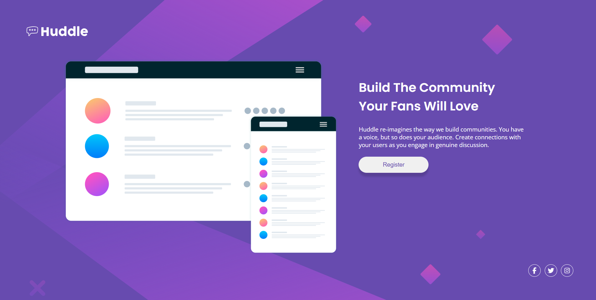

## Overview
This project focuses on recreating a single-section landing page design. I used semantic HTML for the page structure and CSS Flexbox to position the header, main content, and footer. The layout adapts for smaller screens using media queries, with the desktop two-column layout changing into a centered mobile layout.

### Key learnings
- How to use Flexbox for vertical and horizontal alignment.
- How `justify-content` and `align-items` behave differently depending on `flex-direction`.
- How to make a background image cover the page using `object-fit: cover`.
- How inline SVG icons can be styled with CSS using `fill` and hover states.
- How to use media queries to make a desktop layout responsive on mobile.

## Project
- Live Site URL: https://daxitaseervi.github.io/huddle-landing-page/

## Links
- Twitter/X: [https://x.com/kazzyyy__](https://x.com/kazzyyy__)
- Codepen: [https://codepen.io/Daxita-Seervi](https://codepen.io/Daxita-Seervi)
- Frontend Mentor: [https://www.frontendmentor.io/profile/daxitaseervi](https://www.frontendmentor.io/profile/daxitaseervi)
